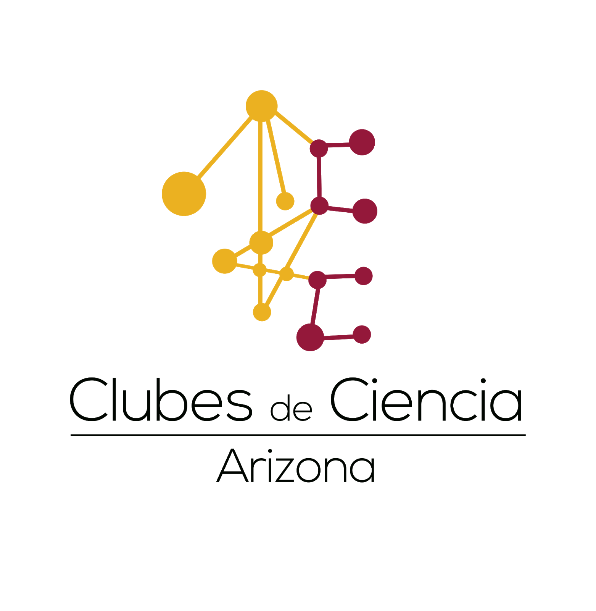

# An electron's point of view: How the quantum world influences materials.

## Installation Guide

Welcome to Clubes de Ciencia Arizona 2021! We are so excited to be working with you this week. We have a lot of things planned but before we get started we need to setup a few things on our computer. We will need to install a _package manager_ called [Anaconda](https://docs.anaconda.com/anaconda/install/) and the [Julia](https://julialang.org) programming language. These will be the two major tools that we will be learning how to use throughout the week. Below we have outlined how to install both of these essential tools for the week's course!

### 1. Installing Anaconda
The [Anaconda](https://docs.anaconda.com/anaconda/install/) documentation is very through to help install this software on Windows, mac OS, and Linux. We've provided the basic steps below, but if you run into any trouble please click on the link.

#### on Windows
1. Start by downloading the Anaconda executable which is available [here](https://www.anaconda.com/download/#windows)
2. Open the file you've just downloaded. This should be in your Downloads folder.
3. A Windows Installer should now be active. Follow the instructions.
4. When you are reach the "Choose Install Location" prompt, choose the default path that it provides. No need to change this.
5. Once you have successfully installed the software you will see the message, **"Thanks for installing Anaconda"**

### 2. Installing Julia
